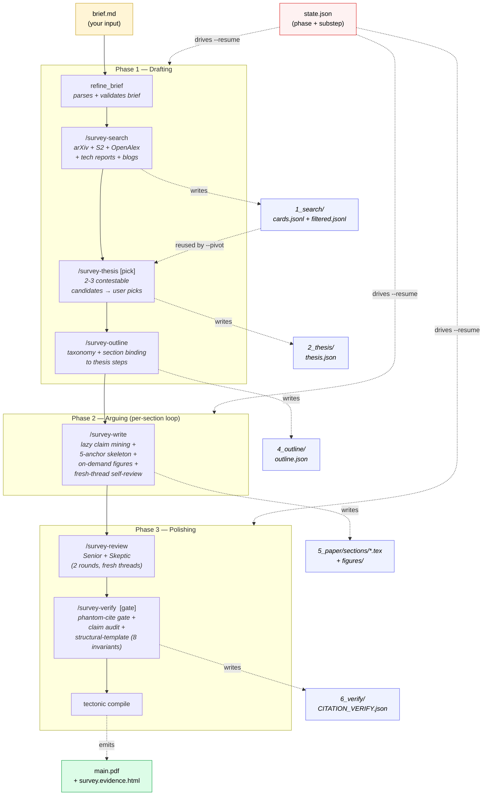

<div align="center">


`brief in → publication-grade literature survey out`


</div>

```text
$ /survey-run --brief brief.md --auto-confirm
→ ./.autosurvey/runs/<id>/main.pdf   # ~25-45+ pp · 50-200 verified citations
```

AutoSurvey is a **skill pack for [Claude Code](https://docs.anthropic.com/claude-code)**: you
write one markdown brief, it runs a three-phase pipeline — **draft → argue → polish** — and
hands back a LaTeX→PDF survey with a clickable `survey.evidence.html` where every `\cite{}`
links to its source.

```text
search ─→ thesis ─→ outline ─→ write ─→ review ─→ verify ─→ main.pdf
(corpus) [pick]    (taxonomy) (5-anchor) (2 personas) [hard gate]
```

No depth knobs. Every run goes full-depth; every audit runs at the strictest level. Length
follows the brief's scope, not a page cap.

**Early release** — use it, fork it, remix the skills and tools; rough edges and moving
interfaces are expected, so play freely and ship your own variants.

---

> [!WARNING]
> **This burns tokens.** Every LLM stage (refine, search synthesis, thesis, outline, per-section
> writing, 2 review rounds, audits) runs on **your host agent's model** — a full run is tens of
> agent turns over 20-60 min. On premium models (**Claude Opus, GPT-5.5**, …) a single survey can
> cost **several to tens of USD** in tokens. Budget accordingly, or run on a cheaper model first.

---

## Quick start

```bash
git clone <repo-url> ~/AutoSurvey && cd ~/AutoSurvey
brew install tectonic          # or: apt-get install tectonic
bash tools/install.sh          # symlink skills + export AUTOSURVEY_TOOLS
exec $SHELL -l                 # so $AUTOSURVEY_TOOLS takes effect
cp examples/briefs/long-context-extension.md brief.md && $EDITOR brief.md
```

Then, from the Claude Code chat **in the directory where you want the output**:

```text
> /survey-run --brief brief.md --auto-confirm
```

Output lands under your **current working directory** at `./.autosurvey/runs/<id>/`. Set
`AUTOSURVEY_RUNS_DIR` to pin a central base instead.

> Codex CLI works the same way (`/survey-run …`). Other skill-aware agents discover the pack by
> name — the usage is identical, so the docs only spell out Claude Code.

### Hands-off vs. supervised

`/survey-run` has exactly **two human decision points**: picking the thesis and the checkpoint
between review rounds. `--auto-confirm` automates both (auto-picks thesis candidate A,
short-circuits the checkpoint) — that flag is what makes the command above a **single
end-to-end run with zero human input**, start to finish.

Drop `--auto-confirm` to stay in the loop:

```text
> /survey-run --brief brief.md
#   → blocks so you can pick the thesis from compiled sample chapters
#   → blocks at the review checkpoint to accept/reject reviewer demands
```

A run takes **20-60 min** depending on corpus size. When it finishes, open the printed `main.pdf`.

---

## Writing a brief

The brief is the *one* thing you write — plain markdown. First line `topic: <X>`, the rest is
free prose: scope, comparison dimensions, per-paper extraction targets.

```markdown
topic: Mixture-of-Experts in Large Language Models

Focus on MoE architectures for autoregressive LLMs from 2017 onward.
Exclude vision-only and multimodal MoE.

Compare along: routing strategy, expert granularity, load balancing,
training precision, and quality benchmarks (MMLU, HumanEval, GSM8K).

For each paper extract: total / active parameters, expert count and
top-k, routing scheme, balancing loss, and the key design rationale.
```

Rules: a `topic`, ≥ ~50 words, ≥ 3 thematic dimensions. **Length follows scope** — more
dimensions → more body sections → a longer survey, each written at full depth. There is no page
gate anywhere. Three example briefs ship in [`examples/briefs/`](./examples/briefs/); matching sample PDFs are in [`examples/pdfs/`](./examples/pdfs/).

---

## What you get

```text
./.autosurvey/runs/moe-llm-20260601-143022/
├── brief.{md,parsed.json}
├── 1_search/    cards.jsonl + filtered.jsonl + claims_cache.jsonl
├── 2_thesis/    thesis.json   (contestable claim + argument steps + objections)
├── 4_outline/   outline.{json,md} + reverse_outline.md
├── 5_paper/
│   ├── main.tex + sections/ + figures/ + references.bib
│   ├── main.pdf                 ← compiled here, copied to run root
│   └── survey.evidence.html     ← every citation, clickable
├── 6_verify/    CITATION_VERIFY.json + claim_audit.json
├── 7_review/    per-round reviewer demands + author responses
├── main.pdf     ← FINAL OUTPUT
├── survey.html  ← optional web preview (pandoc; skipped if absent)
└── state.json   phase + substep status (drives --resume)
```

`survey.evidence.html` is the artefact for spot-checking: every `\cite{key}` sits next to the
sentence using it, linked to the source.

Interrupted? Resume **from the same directory**:

```text
> /survey-run --brief brief.md --resume <run-id>
```

---

## Survey, not a literature dump

Three disciplines separate a survey from a paper-by-paper book report — each a **deterministic
gate**:

| | Discipline | Enforcement |
|---|---|---|
| **1** | **Thesis-driven** — every section binds to one step of a contestable claim you pick from candidates (with sample chapters compiled to PDF). | Load-bearing for outline, writing, audits. |
| **2** | **Closed-set citations** — the writing prompt sees only keys produced by search. | A verifier blocks compile on any phantom key. |
| **3** | **Synthesis-not-summary** — each body section follows a five-anchor skeleton: *Claim · Steelman · Evidence · Concession · So-what*. | Anchored as LaTeX comments; the audit verifies it. |

On top: a **structural template** of eight invariants (citation density, annotated bibliography,
cross-cutting matrix, section nesting, related-surveys subsection, paired open-problems ↔
future-directions, conclusion reframe, contributions cross-refs) enforced at the audit gate.
Thresholds live in [`benchmark-targets.json`](./skills/shared-references/benchmark-targets.json).

Two further checks score what structure can't: **full-text evidence verification**
(`verify_evidence.py` — every mined quote and number checked against the cited paper's *full
text*) and a **semantic quality rubric** (`quality_eval.py` — an LLM-judge scoring thesis,
synthesis, insight, evidence, coverage, structure, readability to a 0-100 bar). Quality is
measured, not assumed.

---

## Pipeline & skills



`[pick]` = load-bearing decision (you pick, or `--auto-confirm` picks for you) · `[gate]` = hard
gate that blocks compile

| Skill | Role |
|---|---|
| [`/survey-run`](skills/survey-run/SKILL.md)       | **Orchestrator.** Runs the three phases, manages `state.json`, supports `--resume`. |
| [`/survey-search`](skills/survey-search/SKILL.md) | arXiv + S2 + OpenAlex + tech reports + blogs; **citation-graph snowball**, scope filter, dedup, paper-existence verification, **anchor-coverage gate**. |
| [`/survey-thesis`](skills/survey-thesis/SKILL.md) | Pick a contestable thesis from candidates; write argument steps + objections. **Load-bearing.** |
| [`/survey-outline`](skills/survey-outline/SKILL.md) | Taxonomy + section binding to thesis steps; declares the cross-cutting matrix. |
| [`/survey-write`](skills/survey-write/SKILL.md)   | Per-section loop — claim mining, 5-anchor skeleton, on-demand figures, self-review. |
| [`/survey-review`](skills/survey-review/SKILL.md) | Two reviewer personas (Senior + Skeptic) + author response (accept / partial / reject). |
| [`/survey-verify`](skills/survey-verify/SKILL.md) | Hard gate (phantom cites) + claim audit + numeric grounding + **full-text evidence verification** + structural invariants. |
| [`/survey-pivot`](skills/survey-pivot/SKILL.md)   | Mid-run thesis pivot when verify reveals an irreparable flaw. |

---

## FAQ

<details>
<summary><b>Where do I type <code>/survey-run</code>?</b></summary>

Inside Claude Code's chat — *not* your terminal. The slash command registers globally once
`tools/install.sh` runs.
</details>

<details>
<summary><b>How much does it cost?</b></summary>

~20-60 min wall-clock. Token cost is whatever your host agent's model charges for tens of turns
— a few USD on mid-tier models, **several to tens of USD on Opus / GPT-5.5**. See the warning at
the top.
</details>

<details>
<summary><b>No Claude Code / Codex — can I still use it?</b></summary>

The skills are markdown SOPs and the tools are plain Python. You can read
`skills/survey-run/SKILL.md` and call the `tools/` helpers directly, but you lose the
orchestration. A skill-aware agent is strongly recommended.
</details>

<details>
<summary><b>Can I edit the PDF mid-run?</b></summary>

No — edit `5_paper/sections/*.tex`, then re-run `/survey-verify` and recompile. PDF hand-edits
are lost on the next run.
</details>

<details>
<summary><b>Run died half-way?</b></summary>

`/survey-run --brief … --resume <run-id>`, **from the same directory**, picks up where
`state.json` left off.
</details>

<details>
<summary><b>The thesis is wrong / boring.</b></summary>

`/survey-pivot --resume <run-id> --new-thesis "<seed>"` re-runs from the thesis step under a
different claim — without redoing the search.
</details>

---

## Install

```bash
bash tools/install.sh          # all detected agents
bash tools/install.sh --dry-run # preview, write nothing
bash tools/uninstall.sh        # remove symlinks
```

It (1) symlinks each `skills/survey-*` into your agent's skills dir (`~/.claude/skills/`, etc.,
whichever exist) and (2) appends `export AUTOSURVEY_TOOLS=<repo>/tools` to your shell profile.
Idempotent; refuses to clobber non-symlink files.

```bash
echo "$AUTOSURVEY_TOOLS"                  # → <repo>/tools
ls ~/.claude/skills/ | grep ^survey-      # 8 entries
```

**Optional deps:** `matplotlib` (timeline / scaling figures) · `pandoc` (`survey.html` preview).
Core pipeline is stdlib + the agent's HTTP fetcher.

---

## Tests

```bash
pytest -q                          # full suite (544 tests)
```

---

## Contributing

Each skill is self-contained under `skills/<name>/SKILL.md` and resolves helpers through
`$AUTOSURVEY_TOOLS`. To add a figure type, audit, or quality check:

1. Implement `tools/<name>.py` — Python 3.10+, stdlib-preferred, no heavy ML deps in the core path.
2. Reference it from the right `skills/<skill>/SKILL.md` step.
3. Add a smoke invocation to `AGENT.md`.

---

## License

MIT — see [`LICENSE`](./LICENSE).
